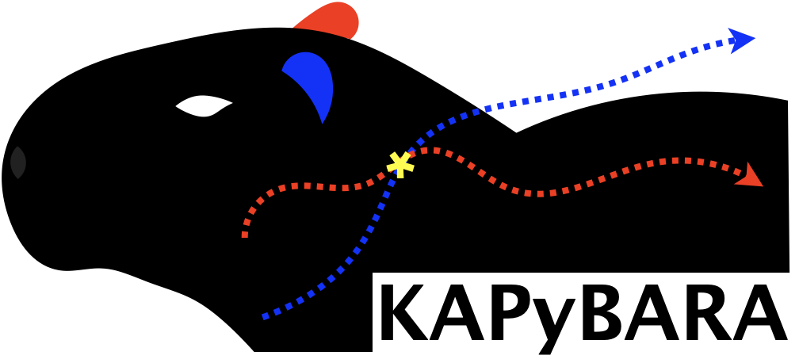

<h1 align="center">

</h1>

<p align="center">
  <b>K</b>ob-<b>A</b>ndersen model simulation with <b>Py</b>thon-<b>BA</b>sed t<b>RA</b>jectory sampling
</p>

<p align="center">
  
  
  
  
</p>

---

KAPyBARA is a Python package for running **Transition Path Sampling (TPS)** simulations of the Kob-Andersen binary Lennard-Jones glass-former on HPC clusters. It drives LAMMPS through its Python API and manages the entire simulation lifecycle — from initial equilibration to multi-field TPS acquisition — via SLURM job orchestration.

## Features

- **One-command workflow** — `kapybara prerun` equilibrates initial trajectories; `kapybara run` runs all TPS simulations to completion
- **Automatic field dependency scheduling** — simulations at non-zero field values branch from lower-field parents via a DAG; child jobs are submitted as soon as the parent accumulates enough statistics
- **Fault-tolerant re-submission** — failed replicas are re-submitted automatically with exactly the right number of CPUs, without re-running completed replicas
- **Crash-safe checkpointing** — trajectories are saved as `.npy` dump files at configurable intervals; any interrupted job resumes from the last checkpoint
- **SQLite state tracking** — a single `kapybara.db` file replaces all legacy `.chk` and `.jobID` files
- **Live monitoring** — `kapybara monitor` shows a colour-coded (T × field) progress board; `kapybara queue` shows a live SLURM queue table with per-job TPS progress

## How It Works

```
┌─────────────────────────────────────────────────────────────────┐
│  kapybara prerun -c config.yaml                                 │
│                                                                 │
│  For each T: submit SLURM job → minimize → equilibrate →        │
│              production MD → save step1/trj/{T}/{r}.npy         │
└──────────────────────────┬──────────────────────────────────────┘
                           │ prerun complete
                           ▼
┌─────────────────────────────────────────────────────────────────┐
│  kapybara run -c config.yaml                                    │
│                                                                 │
│  Scheduler polls every 10 s:                                    │
│    ┌── root node (field=0) ready? ──► submit relax + acqui TPS  │
│    └── child node branching ready? ─► submit from parent dump   │
│                                                                 │
│  Each TPS job: n_relax relaxation runs → n_acqui acquisition    │
│                runs → save step2/trj, step2/ene, step2/csv      │
└─────────────────────────────────────────────────────────────────┘
```

Each SLURM job spawns `n_replica` independent workers via `multiprocessing`. All TPS moves (shooting and shifting) use Metropolis-Hastings acceptance with the weight function `exp(-s·ΔK - g·ΔE)`.

## Quick Start

Copy `example.yaml` from the repository, edit `work_directory` and `partition`, then:

```bash
kapybara prerun -c config.yaml                      # equilibrate initial trajectories
kapybara run    -c config.yaml                      # run TPS (polls until complete)
kapybara run    -c config.yaml --bg                 # detach to background; stdout/stderr → kapybara.log
kapybara run    -c config.yaml --bg --log run.log   # redirect background output to run.log
kapybara stop   -c config.yaml                      # stop a backgrounded scheduler
kapybara monitor -c config.yaml -w 30               # live progress board
kapybara queue   -c config.yaml --eta               # show ETA per running job
```

For a full walkthrough and config field descriptions, see the [documentation](https://kapybara.readthedocs.io).

## Architecture

KAPyBARA follows a strict single-responsibility design. Each sub-package owns exactly one domain:

| Package | Responsibility |
|---------|----------------|
| `config/` | YAML parsing, frozen `SimulationConfig`, all path strings |
| `core/` | LAMMPS instance setup, thermostat strategies, activity observable |
| `state/` | SQLite state tracking (`StateDB`) and single-writer concurrency (`DBWriter`) |
| `orchestrate/` | Field-dependency DAG, SLURM helpers, `Scheduler` polling loop |
| `sampling/` | TPS move logic (shooting, shifting, Metropolis-Hastings acceptance) and per-replica run loops |
| `prepare/` | Prerun workflow: minimize → equilibrate → production MD |
| `commands/` | `multiprocessing` entry points called by SLURM `srun` |
| `cli/` | `argparse` wiring and thin orchestration calls |

## Installation

KAPyBARA requires LAMMPS to be compiled in **shared mode** with its Python API enabled — this is the only non-trivial step. The short version (uv):

```bash
# 1. Build LAMMPS (shared + MPI + Python API)
git clone -b release https://github.com/lammps/lammps.git /path/to/lammps
cd /path/to/lammps && mkdir build && cd build
cmake ../cmake -D BUILD_SHARED_LIBS=yes -D BUILD_MPI=yes -D BUILD_OMP=yes -D LAMMPS_MACHINE=mpi
make -j$(nproc) && make install

# 2. Install LAMMPS Python bindings and KAPyBARA into a uv venv
uv venv && source .venv/bin/activate
uv pip install lammps-*.whl          # wheel produced by cmake in lammps/build/
git clone https://github.com/kadryjh1724/kapybara.git /path/to/KAPyBARA
cd /path/to/KAPyBARA && uv pip install .
```

After installing, add the venv's `bin/` to your `PATH` so `kapybara` works from any directory:

```bash
echo 'export PATH="/path/to/KAPyBARA/.venv/bin:$PATH"' >> ~/.bashrc
source ~/.bashrc
```

For full instructions including the conda path, wheel naming, verification steps, and SLURM job script setup, see the **[Installation Guide](https://kapybara.readthedocs.io/en/latest/installation.html)** in the documentation.

## Quickstart for Agents

<div></div>

```prompt
Requirements: LAMMPS (shared build + Python API), SLURM

1. Clone and install KAPyBARA:
   git clone https://github.com/kadryjh1724/kapybara.git && cd KAPyBARA
   pip install .

2. To understand this whole codebase, read CODEBASE.md.

3. Write a config file (see Quick Start section above), then run:
   kapybara prerun -c config.yaml   # equilibrate initial trajectories for each T
   kapybara run   -c config.yaml   # submit and poll TPS jobs until completion

4. Monitor progress:
   kapybara monitor -c config.yaml  # (T × field) progress board
   kapybara queue   -c config.yaml  # live SLURM queue view

Note: LAMMPS must be built in shared mode with its Python API enabled.
See the Installation section above for full build instructions.
```

---

<p align="center">
Powered by <a href="https://github.com/lammps/lammps">LAMMPS</a>
</p>
